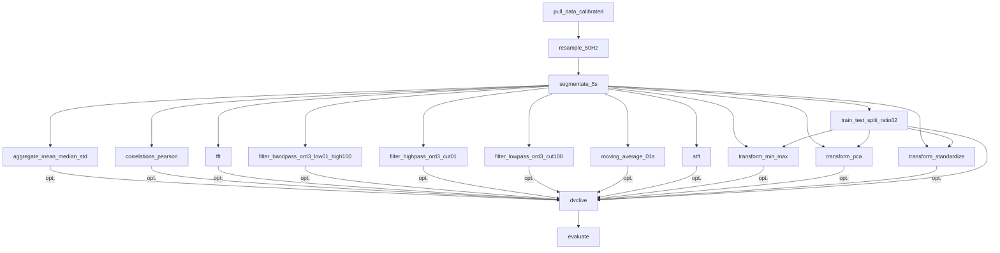

# Stages
Stages werden in der dvc.yaml Datei erstellt. Die Stages verwenden die Python Skripte aus dem Ordner 'src', welche Modulare Funktionalitäten anbieten.
## DAG 
Um eine Übersicht über die Pipeline zu erhalten, kann der Befehl 'dvc dag' verwendet werden.

## Skripts für Tabulare Daten
Hier werden alle Skripts aufgelistet, welche Tabulare Daten (.parquet) als Input verwenden.
| Skript                | Beschreibung                                         | Output Typ       |
| --------------------- | ---------------------------------------------------- | ---------------- |
| pull_data.py          | Holt die gesammelten Daten von der Datenbank         | Tabular          |
| resample.py           | Resamplet die Daten auf eine bestimmte Frequenz      | Tabular          |
| segmentate.py         | Segmentiert die Daten in bestimmte Zeitfenster       | Segmente         |

## Skripts für Segmentierte Daten
Hier werden alle Skripts aufgelistet, welche Segmentierte Daten (.dill) als Input verwenden.
| Skript                | Beschreibung                                        | Output Typ             |
| --------------------- | --------------------------------------------------- | ---------------------- |
| aggregate.py          | Aggregiert die Daten anhand einer Aggregationsliste | Segmente               |
| butterworth_filter.py | Filtert die Daten mit einem Butterworth Filter      | Segmente               |
| correlations.py       | Berechnet die Korrelationen zwischen den Features   | Tabular                |
| fft.py                | Führt eine FFT auf den Daten durch                  | Segmente               |
| moving_average.py     | Berechnet den Moving Average der Daten              | Segmente               |
| train_test_split.py   | Teilt die Daten in Trainings- und Testdaten auf     | JSON Element           |
| transform.py          | Verarbeitet die Daten mit Scaler oder PCA           | Segmente + Transformer |

## Skripts für Trainieren und Evaluieren von Modellen
Hier werden alle Skripts aufgelistet, welche für das Trainieren und Evaluieren von Modellen verwendet werden.
| Skript          | Beschreibung                                       | Output Typ               |
| --------------- | -------------------------------------------------- | ------------------------ |
| evaluate.py     | Erstellt anhand der Metriken alle benötigten Plots | Plots                    |
| model_runner.py | Führt ein Modell aus                               | Metriken und Vorhersagen |
